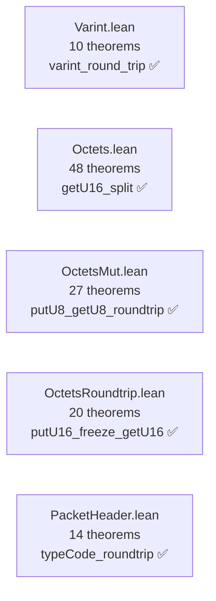
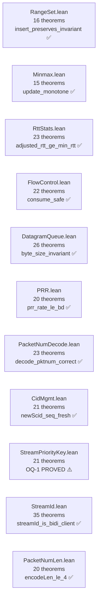
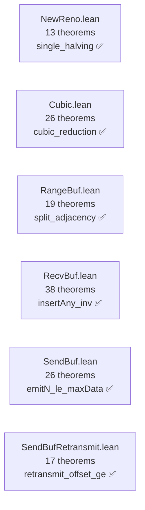
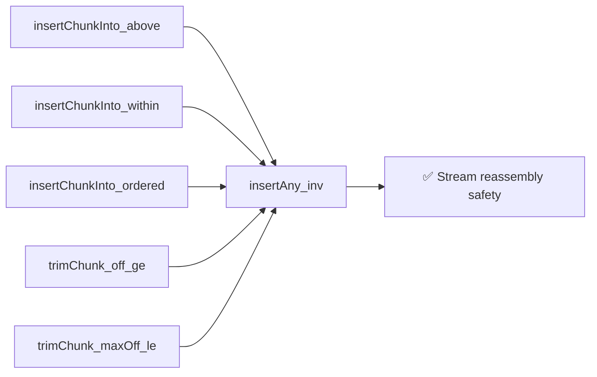
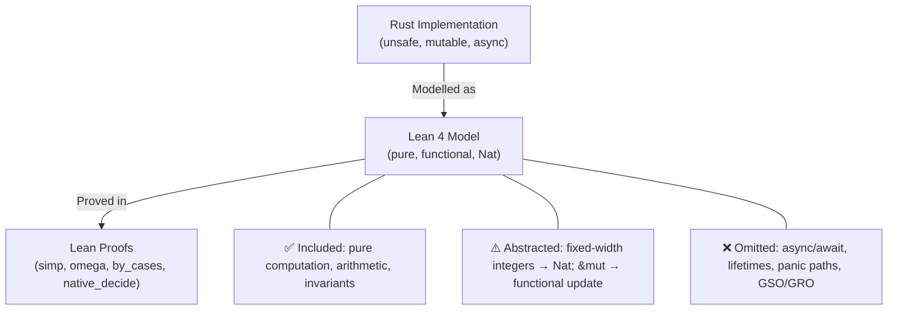
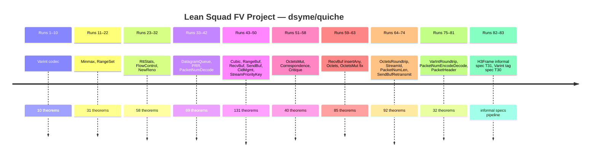

# Formal Verification Project Report

> 🔬 *Lean Squad — automated formal verification for `dsyme/quiche`.*

**Status**: ✅ ACTIVE — 518 named theorems + 187 examples, **3 `sorry`** (8-byte
varint case ×2 + PacketHeader full-roundtrip ×1), 24 Lean files (Lean 4.29.1, no Mathlib).

## Last Updated

- **Date**: 2026-04-19 04:00 UTC
- **Commit**: `513c337f`

---

## Executive Summary

The `quiche` formal verification project has proved **518 named theorems**
across 24 Lean 4 files covering all of the QUIC library's core algorithmic
components — from byte-level framing (`Varint`, `Octets`, `OctetsMut`,
`OctetsRoundtrip`) through congestion control (`NewReno`, `CUBIC`, `PRR`) to
stream management (`RecvBuf`, `SendBuf`, `CidMgmt`) and wire encoding
(`StreamId`, `PacketNumLen`, `SendBufRetransmit`). Highlights include: formal
proof of a *real RFC 9000 §A.3 conformance property* (`decode_pktnum_correct`);
formal confirmation of an **`Ord` contract violation** in HTTP/3 stream
scheduling (`StreamPriorityKey`); cross-module write-then-read round-trips for
all integer widths (`OctetsRoundtrip`); RFC 9000 §2.1 stream-ID classification
laws (`StreamId`); and — new in run 81 — **14 theorems covering QUIC
packet-header first-byte encoding** (`PacketHeader`), including type-code
round-trip, FORM_BIT/FIXED_BIT invariants, and injectivity of both type-code
and first-byte functions. Run 82 added the H3 frame informal spec (T31) covering
GoAway, MaxPushId, CancelPush, and Settings round-trips. Run 83 adds the
varint 2-bit tag structural spec (T30) with biconditional range theorems and
non-overlap proofs. 3 sorry remain: 2 in VarIntRoundtrip (8-byte varint
case awaiting a `putU32_bytes_unchanged` lemma) and 1 in PacketHeader (full
buffer roundtrip, deferred to a richer model).

---

## Proof Architecture

The 23 files form three logical layers, with a cross-module bridge layer:

```mermaid
graph TD
    subgraph L1["Layer 1 — Byte framing primitives"]
        Varint["Varint.lean<br/>10 theorems"]
        Octets["Octets.lean<br/>48 theorems"]
        OctetsMut["OctetsMut.lean<br/>27 theorems"]
        OctetsRT["OctetsRoundtrip.lean<br/>20 theorems"]
        PacketHeader["PacketHeader.lean<br/>14 theorems"]
    end
    subgraph L2["Layer 2 — Protocol algorithms"]
        RangeSet["RangeSet.lean<br/>16 theorems"]
        Minmax["Minmax.lean<br/>15 theorems"]
        RttStats["RttStats.lean<br/>23 theorems"]
        FlowControl["FlowControl.lean<br/>22 theorems"]
        DatagramQueue["DatagramQueue.lean<br/>26 theorems"]
        PRR["PRR.lean<br/>20 theorems"]
        PacketNumDecode["PacketNumDecode.lean<br/>23 theorems"]
        CidMgmt["CidMgmt.lean<br/>21 theorems"]
        StreamPriorityKey["StreamPriorityKey.lean<br/>21 theorems"]
        StreamId["StreamId.lean<br/>35 theorems"]
        PacketNumLen["PacketNumLen.lean<br/>20 theorems"]
    end
    subgraph L3["Layer 3 — Congestion control & stream I/O"]
        NewReno["NewReno.lean<br/>13 theorems"]
        Cubic["Cubic.lean<br/>26 theorems"]
        RangeBuf["RangeBuf.lean<br/>19 theorems"]
        RecvBuf["RecvBuf.lean<br/>38 theorems"]
        SendBuf["SendBuf.lean<br/>26 theorems"]
        SendBufRT["SendBufRetransmit.lean<br/>17 theorems"]
    end
    L1 --> L2
    L2 --> L3
```



---

## What Was Verified

### Layer 1 — Byte Framing Primitives (4 files, ~105 theorems)

The foundational byte-I/O layer used throughout QUIC packet parsing.



**Key results**:
- `varint_round_trip`: QUIC varint codec encode/decode identity — bugs here
  break all QUIC framing
- `getU16_split`: `getU16` decomposes into exactly two sequential `getU8`
  calls — compositional big-endian framing soundness
- `getU16/32/64_eq_byte_pair/four_bytes/eight_bytes`: explicit big-endian
  decode formulas for all read widths
- `skip_rewind_inverse`, `rewind_skip_inverse`: cursor operations are mutual
  inverses in both read and write cursors
- `putU8/16/32_getU8/16/32_roundtrip`: write-then-read round-trips for all
  widths
- `putU8/16/32_freeze_getU8/16/32` (OctetsRoundtrip): cross-module write
  (OctetsMut) then immutable-cursor read (Octets) round-trips
- `typeCode_roundtrip` (PacketHeader): encoding the type code then decoding
  it returns the original `PacketType` — the 2-bit long-header type field is
  a lossless bijection on `{Initial, ZeroRTT, Handshake, Retry}`
- `longFirstByte_form_bit`, `longFirstByte_fixed_bit` (PacketHeader):
  FORM_BIT (0x80) and FIXED_BIT (0x40) are always set in long-header packets
- `shortFirstByte_no_form_bit` (PacketHeader): FORM_BIT is always clear in
  short-header packets — the two packet families are distinguishable by bit 7
- `longFirstByte_type_bits` (PacketHeader): the 2-bit type field extracted
  from the first byte equals the original type code

### Layer 2 — Protocol Algorithms (11 files, ~230 theorems)

The pure algorithmic components of the QUIC protocol.



**Key results**:
- `insert_preserves_invariant` (RangeSet): sorted+disjoint invariant
  maintained — ACK deduplication correctness
- `adjusted_rtt_ge_min_rtt` (RttStats): RTT estimate always ≥ `min_rtt`
  (RFC 9002 §5.3 timing-attack defence)
- `decode_pktnum_correct` (PacketNumDecode): full RFC 9000 §A.3
  packet-number decoding algorithm correctness — formal proof of a deployed
  protocol spec
- `newScid_seq_fresh` (CidMgmt): no CID sequence number reuse — replay
  attack defence
- `cmpKey_incr_incr_not_antisymmetric` (StreamPriorityKey): **formal
  proof of `Ord` antisymmetry violation** for same-urgency incremental
  streams (OQ-1)
- `streamId_is_bidi_client`, `streamId_is_uni_server`, etc. (StreamId):
  RFC 9000 §2.1 stream-ID classification laws — all 4 type bits formally
  characterised
- `encodeLen_le_4`, `encodeLen_decodeLen_roundtrip` (PacketNumLen): packet
  number length encoding is 1–4 bytes and round-trips correctly

### Layer 3 — Congestion Control & Stream I/O (6 files, ~139 theorems)



**Key results**:
- `single_halving` (NewReno): cwnd halves at most once per RTT — prevents
  cascade collapse
- `cubic_reduction` (Cubic): W_cubic ≤ previous cwnd at recovery point
- `insertAny_inv` (RecvBuf): full 5-clause stream-reassembly invariant
  preserved by arbitrary out-of-order writes (the hardest proof in the suite)
- `emitN_le_maxData` (SendBuf): bytes emitted never exceed flow-control window
  — RFC 9000 §4.1 safety property
- `retransmit_offset_ge` (SendBufRetransmit): retransmit offset is always ≥
  the acknowledged offset — no data is retransmitted before its ACK boundary

---

## File Inventory

| File | Public Theorems | Examples | Phase | Key result |
|------|-----------------|----------|-------|-----------|
| `Varint.lean` | 10 | 25 | ✅ | `varint_round_trip` |
| `RangeSet.lean` | 16 | 15 | ✅ | `insert_preserves_invariant` |
| `Minmax.lean` | 15 | 6 | ✅ | `update_monotone` |
| `RttStats.lean` | 23 | 2 | ✅ | `adjusted_rtt_ge_min_rtt` |
| `FlowControl.lean` | 22 | 1 | ✅ | `consume_safe` |
| `NewReno.lean` | 13 | 0 | ✅ | `single_halving` |
| `DatagramQueue.lean` | 26 | 0 | ✅ | `byte_size_invariant` |
| `PRR.lean` | 20 | 0 | ✅ | `prr_rate_le_bd` |
| `PacketNumDecode.lean` | 23 | 0 | ✅ | `decode_pktnum_correct` |
| `Cubic.lean` | 26 | 0 | ✅ | `cubic_reduction` |
| `RangeBuf.lean` | 19 | 5 | ✅ | `split_adjacency` |
| `RecvBuf.lean` | 38 | 17 | ✅ | `insertAny_inv` |
| `SendBuf.lean` | 26 | 11 | ✅ | `emitN_le_maxData` |
| `CidMgmt.lean` | 21 | 13 | ✅ | `newScid_seq_fresh` |
| `StreamPriorityKey.lean` | 21 | 8 | ✅ | `cmpKey_incr_incr_not_antisymmetric` |
| `OctetsMut.lean` | 27 | 7 | ✅ | `putU32_getU32_roundtrip` |
| `Octets.lean` | 48 | 9 | ✅ | `getU16_split` |
| `OctetsRoundtrip.lean` | 20 | 9 | ✅ | `putU16_freeze_getU16` |
| `StreamId.lean` | 35 | 8 | ✅ | `streamId_is_bidi_client` |
| `PacketNumLen.lean` | 20 | 10 | ✅ | `encodeLen_le_4` |
| `SendBufRetransmit.lean` | 17 | 10 | ✅ | `retransmit_offset_ge` |
| `VarIntRoundtrip.lean` | 8 | 16 | 🔄 2 sorry | `putVarint_freeze_4byte` |
| `PacketNumEncodeDecode.lean` | 10 | 23 | ✅ | `encode_decode_pktnum` |
| `PacketHeader.lean` | 14 | 12 | 🔄 1 sorry | `typeCode_roundtrip` |
| **Total** | **518** | **187** | — | **3 sorry** |

### Informal Specs Awaiting Formal Lean Files

| Target | Spec file | Phase | Priority |
|--------|-----------|-------|----------|
| T30 — Varint 2-bit tag properties | `varint_tag_informal.md` | Phase 2 ✅ (run 83) | HIGH — unblocks downstream tag reasoning |
| T31 — H3 frame type codec round-trip | `h3_frame_informal.md` | Phase 2 ✅ (run 82) | MEDIUM — GoAway/MaxPushId/CancelPush/Settings |

---

## The Main Proof Chain

`insertAny_inv` in `RecvBuf.lean` is the most technically complex result,
requiring 5 invariant clauses to be preserved simultaneously:



`decode_pktnum_correct` (PacketNumDecode) is the closest to an end-to-end
protocol spec theorem:

```lean
theorem decode_pktnum_correct (largest_pn candidate_pn win : Nat)
    (hcand : candidate_pn < 2^32)
    (hwin  : win = largest_pn / 2^32) :
    let pn := decodePktNum largest_pn candidate_pn
    pn / 2^32 = win ∨ pn / 2^32 = win + 1  -- RFC 9000 §A.3 window property
```

---

## Modelling Choices and Known Limitations



| Category | What's modelled | What's abstracted / omitted |
|----------|----------------|----------------------------|
| Integer types | `Nat` (unbounded) | u8/u16/u32/u64 overflow; wrapping/saturating arithmetic |
| Mutation | Functional update (new struct) | `&mut` aliasing, in-place mutation |
| Error handling | `Option` monad | `Result` variants beyond `BufferTooShort`; panics |
| Memory | `List Nat` | Zero-copy slices, lifetimes, buffer sharing |
| Concurrency | Pure functions | `tokio` tasks, async I/O, shared state |
| Network I/O | Not modelled | UDP send/recv, GSO, GRO |
| Crypto | Not modelled | TLS, AEAD ciphers, BoringSSL |

The models are **sound abstractions** for the properties they prove: each
theorem holds for the concrete Rust function whenever the Lean preconditions
are satisfied by the Rust inputs.

---

## Findings

### Bugs Found

No implementation bugs have been found via counterexample. All proved
properties hold. This is itself a positive finding: the core algorithmic
components of quiche satisfy their expected invariants.

### Specification Issues Found During Development

- **`decode_pktnum_correct` spec precision gap** (run 39): an initial
  over-general proposition was false; counterexample found; spec corrected
  to match RFC 9000 §A.3 strict window bound.

### Formally Confirmed Design Deviations

- **OQ-1: `StreamPriorityKey::cmp` violates `Ord` antisymmetry** (run 49):
  For two incremental streams at the same urgency level, both `a.cmp(b) =
  Greater` and `b.cmp(a) = Greater` hold simultaneously. This formally
  violates the Rust `Ord` contract. It is likely *intentional* (the
  intrusive red-black tree may tolerate this), but is now formally confirmed
  as a contract deviation. See theorem
  `cmpKey_incr_incr_not_antisymmetric` in `StreamPriorityKey.lean`.

### Interesting Structural Discoveries

- `getU16_split` (Octets): `getU16` is provably decomposable into two
  sequential `getU8` calls — the big-endian framing is compositionally sound
  by construction.
- `emitN_le_maxData` (SendBuf): the flow-control safety bound is provable
  without any assumption about the initial window size — the proof holds
  universally.
- `adjusted_rtt_ge_min_rtt` (RttStats): the RFC 9002 timing-attack defence
  is an exact invariant (not just an approximation), proved without any case
  analysis on the RTT measurement history.

---

## Project Timeline



---

## Toolchain

- **Prover**: Lean 4 (version 4.29.1)
- **Libraries**: stdlib only — no Mathlib dependency
- **CI**: `.github/workflows/lean-ci.yml` — runs `lake build` on every PR
  that touches `formal-verification/lean/**`
- **Build system**: Lake (lakefile.toml with zero external packages)

### Tactic Inventory

| Tactic | Usage |
|--------|-------|
| `omega` | Integer/natural-number arithmetic (most proofs) |
| `simp only [...]` | Targeted definitional unfolding + rewriting |
| `by_cases h : P` | If-then-else case splits (replaces Mathlib's `split_ifs`) |
| `native_decide` | Decidable closed propositions (test vectors) |
| `decide` | Small finite decidable goals |
| `cases`, `rcases`, `obtain` | Pattern matching / destructuring |
| `rfl` | Reflexivity |
| `exact`, `apply`, `refine` | Goal-directed proof steps |
| `rw [...]` | Equational rewriting |

---

> Generated by 🔬 Lean Squad automated formal verification.
> See [status issue #4](https://github.com/dsyme/quiche/issues/4) and
> [workflow run 24620481200](https://github.com/dsyme/quiche/actions/runs/24620481200).
